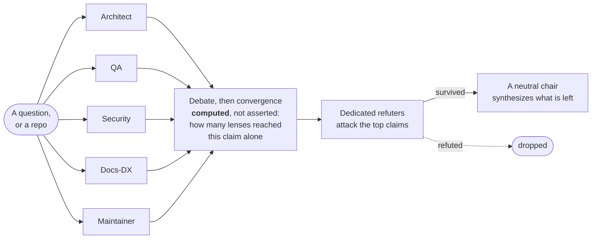

# Augusto Bastos

**AI Engineer** — multi-agent orchestration, MCP servers, and the production plumbing underneath. Open source, runnable, documented.

📍 Limerick, Ireland · [Portfolio](https://augustobastos.pages.dev) · [LinkedIn](https://www.linkedin.com/in/augustobastos) · [Upwork](https://www.upwork.com/freelancers/~01ac65dd1eed26dbc4) · [Email](mailto:augustobastos123@gmail.com)

I design systems where several models, tools and services cooperate on one real problem — agent councils that propose, debate and adversarially verify; MCP servers that give an LLM safe hands on real APIs; and the unglamorous layer underneath (multi-tenant data, auth, billing, deploys) that a real product needs to exist.

Most product source is private — it's commercial. Everything below is **open, runnable, or written up as a case study** you can read end to end.

  

A live card rendered from my own coding hooks. Built with <a href="https://github.com/augbastos/devcard">devcard</a> — MIT, works with any agent that commits.

---

## Selected work

### 🔏 SCPE — verifiable provenance for what an agent produced

When a pull request arrives from someone you don't know — a person, or increasingly an AI agent — trust rests on a username and reading the diff by eye. SCPE adds a signed envelope proving **who** produced a contribution and that **nothing was tampered with**, verified offline with no protocol server and no new accounts, using signing keys the contributor's git host already publishes.

I wrote the spec and **three independent verifiers — Python, Go and Rust — held to the same verdict across 18 normative test vectors** by a differential test, plus 8 adversarial ones. Ships as a GitHub Action that seals or gates pull requests.

**The protocol runs on itself**: this repo and seven others fail a pull request that arrives with no AI-use disclosure — including the ones my own agents open.

`Apache-2.0` → [Site](https://augbastos.github.io/scpe/) · [Repo](https://github.com/augbastos/scpe) · [PyPI](https://pypi.org/project/scpe-protocol/)

### 📡 Wavr — explainable multi-modal sensor fusion, privacy-first

Fuses network scan, WiFi CSI, camera pose and mmWave radar into one *explainable* room-occupancy state: `confidence = strength` (trust weight × the source's own confidence × freshness decay), and the dashboard always shows **why** it believes what it believes.

Ships its own MCP server, so an LLM agent can ask the house what's happening. Loopback-only by default, camera frames never stored, and every sensor path mock-tested — camera, mmWave, WiFi CSI, BLE, and the whole network-discovery stack. Runs with no hardware at all: off-localhost the frontend self-switches to a simulator.

`Python 3.11 · FastAPI · AGPL-3.0` → [Repo](https://github.com/augbastos/wavr)

### 🧾 deputy-mcp — self-hosted MCP server for Deputy (workforce management)

An alternative to the hosted Deputy connectors where your token never leaves your machine. Three auth modes (API token, OAuth 2.0 with loopback flow, iCal fallback) and self-service `/my/*` endpoints, so a plain employee token works without manager permissions — with graceful degradation when access is denied.

Tested end to end against a mocked Deputy API; writes stay locked behind an opt-in flag.

`Python · FastMCP` → [Repo](https://github.com/augbastos/deputy-mcp)

### ⚖️ council — a deliberation engine that distrusts its own consensus

Four lenses on a question, five on a repo (Architect, QA, Security, Docs-DX, Maintainer), propose independently and debate; then the pipeline *computes* convergence — which claims multiple lenses reached alone — adversarially attacks the top claims with dedicated refuters, and only lets a neutral chair synthesize from what survived.

Runs against any repo or question, heterogeneous models per lens, and a deterministic mock backend runs the full pipeline offline. Source private for now — happy to walk through it.

### 🏛️ etica — a book production pipeline in code

Public-domain text in, print-ready book out. A headless Chromium is the typesetter: Paged.js over a stylesheet produces a 6×9 PDF with running heads and real page breaks, alongside EPUB3/Kindle and deterministic generative cover art — the same book built from one source in six languages.

The pipeline and a Part I sample are public; the full adapted prose is a separate paid edition.

→ [Repo](https://github.com/augbastos/etica)

---

## Products & case studies

### 🐱 Lucky Cat — multi-tenant restaurant SaaS

Two full apps on one backend: **Ownly** (owner dashboard — shifts, payroll, stock, cash-up, live orders board) and **Tillr** (customer ordering PWA with real-time tracking). Postgres **Row-Level Security** as the isolation boundary, **Stripe Connect** wired for split payments, Cloudflare at the edge.

First end-to-end version built solo in under two months (June–July 2026); still under active development. Two demo tenants run on the same schema a real store would get, and the card rail is proven end to end in Stripe live mode — infrastructure proven, not a customer: no restaurant has run on it.

→ [Case study](https://github.com/augbastos/lucky-cat-case-study) · [Ownly demo](https://luckycat.ie/demo/ownly) · [Tillr demo](https://luckycat.ie/demo/tillr)

### 🛩️ PitchPilot — field-sales companion with a RAG copilot

A white-label app for door-to-door reps. Its core is **Wingman**, a retrieval-augmented copilot (Supabase **pgvector** + **Gemini**) that answers a rep's question from the product's own playbook — grounded and cited.

The case study is the honest version: an IVFFlat recall collapse on a tiny corpus, a thinking-token budget eating the output, and a cost-ordered model fallback under quota. What actually broke, and how I fixed it.

→ [Case study](https://github.com/augbastos/pitchpilot-case-study) · [Live demo](https://luckycat.ie/pitcher-template/)

### 🔎 rag-demo — the retrieval pipeline, runnable

A minimal, clone-and-run RAG pipeline: chunk → embed → **pgvector** → grounded answer that refuses to invent. `docker compose up`, a local `sentence-transformers` model for keyless indexing, pytest, and a `match_chunks()` SQL function shaped like a Supabase RPC. The inspectable code behind my copilots.

→ [Repo](https://github.com/augbastos/rag-demo)

### 🪪 devcard — live dev stats card for the AI coding era

The card at the top of this page. A local hook captures real AI-assisted coding output (not editor time) and syncs an **anonymized** copy — language and line counts, never project names or code — to a Cloudflare **Worker + D1** that renders an embeddable SVG: i18n by viewer language, auto dark/light, pinned repos with live stars.

It hooks git itself, so it works with **Claude Code, Codex, Cursor, local models — anything that commits**. One-command setup.

`MIT` → [Repo](https://github.com/augbastos/devcard)

Also: **[scrcpy-tray](https://github.com/augbastos/scrcpy-tray)** — your Android phone in the Windows tray, one click to mirror. MIT.

---

## Stack

**Also working with:** multi-agent orchestration · MCP (Model Context Protocol) · RAG pipelines (pgvector, `sentence-transformers`) · Postgres Row-Level Security · Supabase Edge Functions · Stripe Connect · agent hooks and CI-gated agent workflows

---

## Get in touch

Open to **freelance work and AI-engineering roles** — multi-agent systems, MCP servers, RAG pipelines, and full-stack products built to ship.

- 🌐 Portfolio & CV — [augustobastos.pages.dev](https://augustobastos.pages.dev)
- 💼 LinkedIn — [linkedin.com/in/augustobastos](https://www.linkedin.com/in/augustobastos)
- 🟢 Upwork — [freelance profile](https://www.upwork.com/freelancers/~01ac65dd1eed26dbc4)
- ✉️ Email — [augustobastos123@gmail.com](mailto:augustobastos123@gmail.com)
